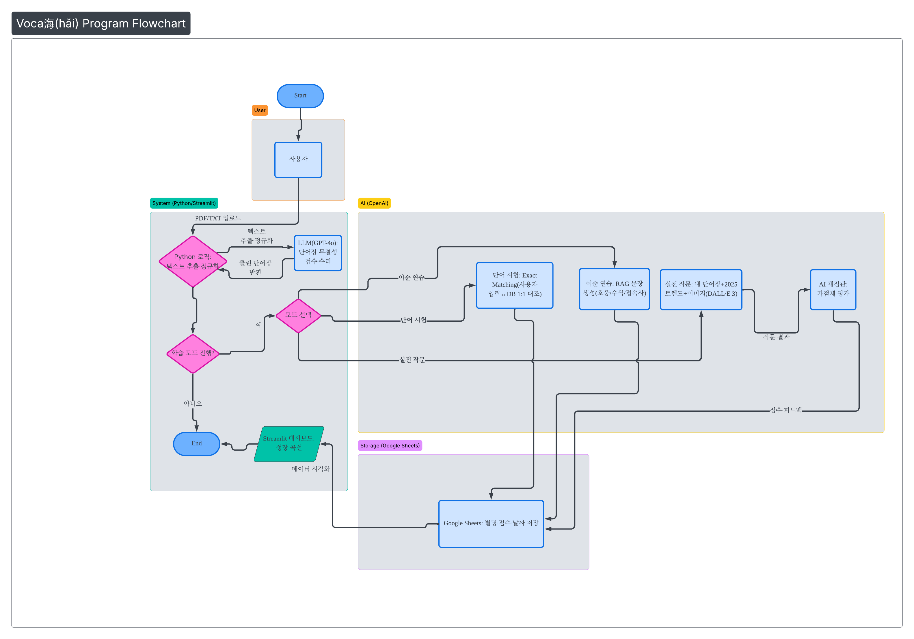

# 🌊 voca海(hǎi) | voca High

> **"단어의 바다에서 자유로이 날다!"**
> 사용자의 단어장 데이터와 2025 HSK 최신 출제 경향 AI가 결합된 **지능형 중국어 실전 학습 플랫폼**

---

## 1. 🛠 제작 배경 (Problem & Opportunity)

* **기존 학습의 번거로움**: 방대한 중국어 단어를 외우고 스스로 테스트를 만드는 과정은 물리적 시간 소모가 컸습니다.
* **현실과의 괴리**: 시중의 많은 앱들이 단순히 단어-뜻 매칭에 그쳐, 실제 HSK의 핵심인 '어순'과 '작문' 실전 감각을 기르기엔 부족했습니다.
* **데이터 활용의 한계**: 내가 가진 PDF/TXT 단어장을 활용해 나만을 위한 맞춤형 문제를 풀고 싶다는 니즈에서 출발했습니다.

---

## 2. 🚀 주요 강점 (Key Strengths)

* **데이터 기반 맞춤형 학습 (RAG-like)**: 사용자가 업로드한 파일(PDF, TXT)에서 AI가 직접 단어를 추출하고 검수하여, 내가 공부하는 범위 내에서만 문제를 출제합니다.
* **별명 기반 성취도 관리**: 별명 하나로 모든 학습 기록이 Google Sheets에 저장되며, 대시보드를 통해 영역별 점수 추이를 한눈에 파악할 수 있습니다.
* **입문자 친화적 UX**: 복잡한 설정 없이 파일 업로드와 별명 입력만으로 즉시 학습을 시작할 수 있는 직관적인 인터페이스를 제공합니다.

---

## 3. 🧠 실제 시험 로직 반영 (Strategic AI Design)

**voca海(hǎi) | voca High**는 단순한 텍스트 생성이 아닌, **철저한 HSK 출제 메커니즘 분석(Deep Research)**을 거친 프롬프트 로직을 기반으로 작동합니다.

* **데이터 무결성 검수 로직**: PDF 파싱 중 발생하는 오타나 노이즈를 AI가 원본 텍스트 문맥과 대조하여 스스로 수리하고 정제합니다.
* **3대 어순 출제 전략**: 단순 무작위 배열이 아닌 **호응 관계(Collocation), 복잡 수식 구조, 논리 접속사**라는 HSK 3대 핵심 문법 포인트를 기준으로 문제를 생성합니다.
* **2025 하이브리드 작문**: 2025년 최신 출제 트렌드인 **4대 의미 클러스터(디지털, 비즈니스 등)** 지식을 AI에게 주입하여, 사용자 단어와 트렌드 단어를 믹스한 실전형 문제를 출제합니다.
* **엄격한 가점제 채점**: 점수 인플레이션을 방지하기 위해 기본점을 설정하고, 고급 어휘 및 문형 사용 여부에 따라서만 추가 점수를 부여하는 **냉정한 가산점 채점 방식**을 채택했습니다.

---

## 📊 표 1. AI 프롬프트 최적화 기록

| 구분 | 초기 모델 (MVP) | 최종 최적화 모델 (voca海) | 핵심 개선 포인트 |
| :--- | :--- | :--- | :--- |
| **단어 검증** | "빈칸을 채워줘" | **"단어장 무결성 검수자"** 로직 | 원본 대조를 통한 노이즈 제거 및 데이터 복구 |
| **어순 연습** | "단어를 섞어줘" | **3대 출제 전략** 기반 생성 | 호응 관계/문법 구조 중심의 변별력 확보 |
| **작문 채점** | "점수를 매겨줘" | **깐깐한 가점제** 채점관 | 거품 제거 및 실전 기준의 엄격한 평가 반영 |

---

## 🏗️ 표 2. 시스템 아키텍처 및 구현 방식

| 기능 | 구현 방식 | RAG 활용 | 핵심 로직/프롬프트 |
| :--- | :--- | :--- | :--- |
| **단어장 수리** | **Pure Logic** | **Yes (DB 참조)** | 사용자 입력값과 DB 텍스트의 100% 일치 여부 확인 |
| **단어 시험** | **RAG + LLM** | **Yes** | 원본 텍스트의 앞뒤 문맥(Context)을 대조하여 병음/뜻 복원 |
| **어순 연습** | **RAG + LLM** | **Yes** | 단어장 내 특정 단어를 추출하여 HSK 3대 전략 기반 문장 생성 |
| **작문 출제** | **RAG + LLM** | **Yes** | 내 단어(3개)와 AI 트렌드 단어(2개)를 하이브리드로 결합 |
| **작문 채점** | **LLM Reasoning** | **No** | 깐깐한 가점제 로직 및 실전 HSK 채점 가이드라인 준수 |

---

## 🛠 Tech Stack

* **Framework**: Streamlit
* **AI Model**: OpenAI GPT-4o, DALL-E 3
* **Database**: Google Sheets API
* **Language**: Python

---

## 🏁 마무리

**voca海(hǎi) | voca High**는 단순히 단어를 외우는 앱이 아닙니다.
나의 자료와 AI의 전략이 만나 **실제 시험에서 점수를 얻는 법을 훈련하는 도구**입니다.

[def]: 플로우차트.png